# CDE_ID_revamp_v5 — Pipeline Flow Diagram

```mermaid
flowchart TD

    %% ── External inputs ──────────────────────────────────────────
    subgraph INPUTS["External Inputs"]
        direction LR
        I_DD["📄 Input data dictionary\n(Excel or CSV)"]
        I_CFG["⚙️ config_prestep.ini\n(paths, columns, thresholds,\nacronyms, prompts)"]
        I_ENV["🔑 .env\n(OPENAI_API_KEY)"]
        I_CRF["📚 CRF_descriptions.json\n(CRF names + descriptions)"]
        I_KB_XLS["📊 Compiled_CORE_CDEs…xlsx\n(HEAL CDE knowledge base)"]
        I_KB_JSON["📄 All_HEALPAINCDEsDD…json\n(row-level flattened KB)"]
        I_VS["☁️ OpenAI Vector Store\n(HEAL Core CRFs for matching)"]
    end

    %% ── Setup (Cells 0–1) ────────────────────────────────────────
    subgraph SETUP["Setup  |  Cells 0–1"]
        S1["Import libraries"]
        S2["Load config\nResolve all file paths\nCreate OpenAI client\nLoad CRF reference text"]
        S3["Read input vars from config:\ninput_file, output_file,\ncrf_column, variable_column,\ndescription_column, encoding_column"]
    end

    %% ── Stage 1: Prestep — CRF Identification (Cells 2–9) ────────
    subgraph PRESTEP["Stage 1 · Prestep — CRF Identification  |  Cells 2–9"]
        direction TB
        P1["Read input file\n→ full_input_df\n→ data_dict_df\n(section, name, description, enumLabels)"]
        P2["Acronym finder\n(variable name → CDE Acronym Finder column)\nloads map from config [Acronyms]"]
        P3["Section context builder\n(infer local form context from\nneighboring rows, prefixes, encodings)\n→ section_context_df"]
        P4["Prestep — LLM call per row\n(CRF name + rationale)\nbatched, checkpointed\n→ Refined CRF Name, Rationale"]:::llm
        P5["Form harmonizer — LLM call per batch\n(collapse variant CRF names → canonical labels)\n→ Canonical CRF Name"]:::llm
        P6["HEAL Core CRF match — LLM call per row\n(match Canonical CRF to official HEAL CRF list\nusing vector store)\n→ HEAL Core CRF Match, Confidence, Rationale"]:::llm
        P7[("prestep_df\n(full_input_df + all prestep columns)")]:::df
    end

    %% ── Stage 2: VLMD Matching (Cells 10–19) ─────────────────────
    subgraph VLMD["Stage 2 · VLMD CDE Matching  |  Cells 10–19"]
        direction TB
        V1["Bridge: prestep_df → study_df\n(copy with config column aliases resolved)"]
        V2["Load HEAL CDE knowledge base\n(Compiled_CORE_CDEs xlsx → cde_df)"]
        V3["Load rules from config:\nProtectedPrimaryFamilies\nSkipVLMDMatchingCRFs\nConceptWeights, Thresholds"]
        V4["Stage 1 — Concept similarity scoring\n(fuzzywuzzy against cde_df concept-family view)\n→ top-3 candidates,\nFinal HEAL CDE Concept Match,\nFinal Concept Match Score/Status/CRF"]
        V5{"Skip VLMD matching?\n(SkipVLMDMatchingCRFs rule)"}
        V6["Stage 2 — Encoding fidelity scoring\n(compare enumLabels vs CDE permissible values)\n→ Final Encoding Fidelity Score/Status"]
        V7["Protected-family rule\n(block off-family primary candidates\nfor copyright-sensitive CRFs)\n→ Protected Family Rule Applied,\nBlocked Primary Candidate"]
        V8[("DDtoCRFtoVLMDCDE_df\n(all rows + matching results)")]:::df
    end

    %% ── Stage 3: Recon Setup (Cells 20–25) ───────────────────────
    subgraph RECON_SETUP["Stage 3 · Recon Setup  |  Cells 20–25"]
        direction TB
        R1["Confirm handoff dataframe exists"]
        R2["Create recon_input_df\nResolve column names → resolved_cols\n(flexible lookup handles renamed columns)"]
        R3["Load recon settings from config:\neligible_concept_statuses, max_rows, dry_run"]
        R4{"Filter: rows with eligible concept status\n(High / Possible concept match)\nAND at least one candidate CDE"}
        R5[("recon_candidate_df\n(eligible rows only)")]:::df
        R6["Form-level consensus\n(group by section, find dominant CRF\nacross high/possible-match rows)\n→ form_consensus_crf, count, share\nmerged onto both recon_input_df\nand recon_candidate_df"]
    end

    %% ── Stage 4: Recon Prep (Cells 26–31) ────────────────────────
    subgraph RECON_PREP["Stage 4 · Recon Preparation  |  Cells 26–31"]
        direction TB
        RP1["Build official candidate packets\n(look up each candidate CDE name\nin All_HEALPAINCDEsDD JSON)\n→ recon_official_candidates list per row"]
        RP2["Clean candidate packets\n(normalize field values to plain strings)\n→ recon_official_candidates_clean"]
        RP3["Protected-family guardrails\n(check if row is anchored to\ncopyright-sensitive family;\nclassify candidates as in-/off-family)\n→ recon_skip_llm flag\n→ recon_preassigned_* for blocked rows\n→ form-consensus rescue for edge cases"]
        RP4{"recon_skip_llm == True?"}
        RP5["Pre-assign result:\nNeeds Human Review\n(off-family or no candidates)"]
        RP6["Build LLM payload\n(row context + form consensus\n+ official candidate packets\n+ protected-family notes)\n→ recon_payload_df"]
    end

    %% ── Stage 5: LLM Adjudication (Cell 32) ──────────────────────
    subgraph LLM_RECON["Stage 5 · LLM Adjudication  |  Cell 32"]
        LR1["Send each payload to LLM\n(structured JSON response)\nbatched with retry logic"]:::llm
        LR2[("llm_recon_results_df\nbest_best_match_cde/crf/variable\nrecon_decision, confidence, rationale)")]:::df
    end

    %% ── Stage 6: Merge & Export (Cells 33–37) ────────────────────
    subgraph EXPORT["Stage 6 · Merge & Export  |  Cells 33–37"]
        direction TB
        E1["Combine LLM results + preassigned results\n→ unified_recon_results_df\n(one row per recon_source_index)"]
        E2["Merge onto recon_candidate_df\n→ recon_candidate_with_results_df"]
        E3["Merge onto full recon_input_df\n→ final_reconciled_df\n(all rows, recon results where eligible)"]
        E4["Build 3 export sheets:\n• metadata — run info\n• final-mapping — clean summary\n• all-outputs — full debug view"]
        E5["Export Excel workbook\n(output_file + '_reconciled.xlsx')"]
    end

    %% ── Output ───────────────────────────────────────────────────
    OUT["📊 Output Excel\n3 sheets:\n  metadata\n  final-mapping\n  all-outputs"]

    %% ── Wiring ───────────────────────────────────────────────────
    I_DD & I_CFG & I_ENV & I_CRF --> SETUP
    I_KB_XLS --> VLMD
    I_KB_JSON --> RECON_PREP
    I_VS --> PRESTEP
    I_ENV --> LLM_RECON

    SETUP --> P1
    P1 --> P2 --> P3 --> P4 --> P5 --> P6 --> P7

    P7 --> V1
    V1 --> V2 --> V3 --> V4 --> V5
    V5 -- "Yes → score=0, skip Stage 2" --> V7
    V5 -- No --> V6 --> V7
    V7 --> V8

    V8 --> R1 --> R2 --> R3 --> R4
    R4 -- "0 eligible rows → recon skipped,\nstill exports with no recon columns" --> E3
    R4 -- "eligible rows" --> R5 --> R6

    R6 --> RP1 --> RP2 --> RP3 --> RP4
    RP4 -- Yes --> RP5 --> E1
    RP4 -- No --> RP6

    RP6 --> LR1 --> LR2 --> E1

    E1 --> E2 --> E3 --> E4 --> E5 --> OUT

    %% ── Styles ───────────────────────────────────────────────────
    classDef llm fill:#fde68a,stroke:#d97706,color:#000
    classDef df fill:#bfdbfe,stroke:#2563eb,color:#000
    classDef input fill:#d1fae5,stroke:#059669,color:#000

    class I_DD,I_CFG,I_ENV,I_CRF,I_KB_XLS,I_KB_JSON,I_VS input
```



---

## Stage summary

| Stage | Cells | Purpose | LLM calls |
|-------|-------|---------|-----------|
| Setup | 0–1 | Load config, open AI client, resolve all file paths | — |
| Prestep | 2–9 | Identify which CRF each variable belongs to | ✅ Prestep (per row), Harmonizer (per batch), HEAL match (per row) |
| VLMD Matching | 10–19 | Score each variable against HEAL CDE knowledge base | — (fuzzywuzzy) |
| Recon Setup | 20–25 | Filter eligible rows, build form-level consensus | — |
| Recon Prep | 26–31 | Look up official KB entries, apply guardrails, build payloads | — |
| LLM Adjudication | 32 | LLM picks best CDE match from candidates | ✅ One call per eligible row |
| Merge & Export | 33–37 | Reconcile all results, write Excel | — |

## Key dataframes and their lineage

```
full_input_df          ← read from input file
  └─ data_dict_df      ← selected columns (section, name, description, enumLabels)
       └─ prestep_df   ← + all prestep columns (Refined CRF Name, HEAL Core CRF Match, …)
            └─ study_df (bridge copy)
                 └─ DDtoCRFtoVLMDCDE_df  ← + VLMD matching columns
                      └─ recon_input_df  (copy)
                           └─ recon_candidate_df  ← filtered to eligible rows
                                └─ recon_payload_df  ← + LLM payloads
                                └─ (+ llm_recon_results_df merged in)
                      └─ final_reconciled_df  ← recon results merged back onto all rows
                           ├─ metadata_sheet_df
                           ├─ final_mapping_sheet_df
                           └─ full_outputs_sheet_df  → output Excel
```

## Proposed module boundaries (for refactoring)

| Module | Cells | Inputs | Outputs |
|--------|-------|--------|---------|
| `config.py` | 0–1 | config_prestep.ini, .env | config object, OpenAI client, resolved paths |
| `prestep.py` | 2–9 | full_input_df, config, client, CRF JSON | prestep_df |
| `vlmd_matching.py` | 10–19 | prestep_df, config, KB xlsx | DDtoCRFtoVLMDCDE_df |
| `recon.py` | 20–32 | DDtoCRFtoVLMDCDE_df, config, client, KB JSON | final_reconciled_df |
| `export.py` | 33–37 | final_reconciled_df, config | output Excel workbook |
| `pipeline.py` | — | input CSV/Excel path, config path, env path | output Excel path |
