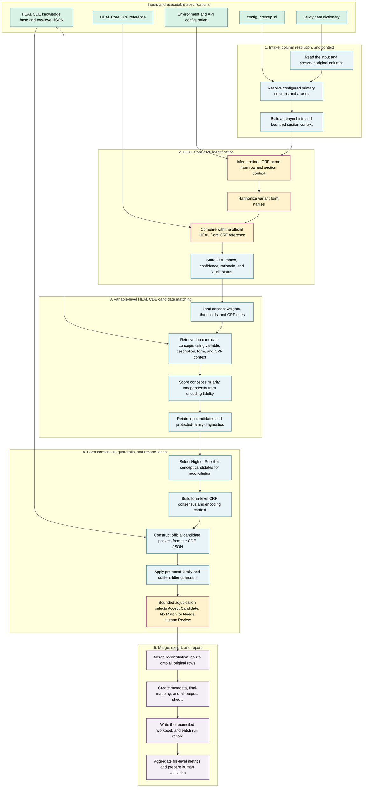

# CDE-ID Detective v6: Detailed Pipeline Flow

This document describes the technical flow from a submitted study data dictionary to the final reconciled workbook and reporting layer. See [`workflowdiagram.md`](workflowdiagram.md) for the high-level version and [`README.md`](README.md) for output definitions and metric guidance.

## Detailed workflow



## Stage summary

| Stage | Purpose | Main outputs |
|---|---|---|
| Intake and context | Read the input, preserve original fields, resolve aliases, and build bounded context | Resolved input columns, acronym hints, section-context fields |
| CRF identification | Infer, harmonize, and compare the study form with official HEAL Core CRFs | `HEAL Core CRF Match`, `Prestep CRF Confidence`, rationale, operational status |
| Variable-level matching | Retrieve candidate CDEs and separately measure concept similarity and encoding fidelity | Top candidates, concept score and status, fidelity score and status |
| Reconciliation | Use form consensus, official candidate packets, and guardrails to select the final mapping | Final CDE, CRF, variable, decision, confidence, rationale, result source |
| Export and reporting | Merge results onto all rows, export three views, and calculate file-level metrics | Reconciled workbook, run report, file summary, validation-ready detail |

## Scoring and decision layers

The pipeline deliberately separates retrieval evidence from the final decision.

| Layer | Main question | Key fields | Important boundary |
|---|---|---|---|
| CRF identification | Which HEAL Core form does the row or section most resemble? | `HEAL Core CRF Match`, `Prestep CRF Confidence` | A CRF anchor supplies context but does not independently establish a variable-level CDE match. |
| Concept retrieval | Does the study variable represent the same concept as a HEAL CDE candidate? | `Final HEAL CDE Concept Match`, `Final Concept Match Score`, `Final Concept Match Status` | Encoding is excluded from candidate selection so different local codes do not automatically hide a concept match. |
| Encoding fidelity | How similarly was the selected concept implemented? | `Final Encoding Fidelity Score`, `Final Encoding Fidelity Status` | A low score can indicate different encodings or missing encoding evidence. |
| Reconciliation | Which official candidate, if any, should become the final mapping? | `best_best_match_cde`, `best_best_match_variable`, `recon_decision`, `recon_confidence` | Reconciliation may select a different candidate, so pre-reconciliation scores must be checked or recomputed before final reporting. |
| Human validation | Was the proposed final mapping correct? | Confirmed, revised, rejected, unresolved outcomes | This is the layer required to calculate observed mapping precision. |

## Concept-similarity calculation

Candidate concept retrieval uses a weighted combination of fuzzy similarity signals configured in `config_prestep.ini`.

Current default weights are:

| Signal | Weight |
|---|---:|
| Study variable name versus official CDE variable name | 0.25 |
| Study description or field label versus official question text | 0.50 |
| Study form name versus official CDE CRF | 0.15 |
| Pre-step HEAL Core CRF versus official CDE CRF | 0.10 |

A configured CRF-context bonus may be added when the pre-step CRF and candidate CRF align. The score is capped at 100.

Default concept categories are:

| Score | Status |
|---:|---|
| 75-100 | High concept match |
| 50-74.9 | Possible concept match |
| 25-49.9 | Weak concept match |
| Below 25 | No confident concept match |

Thresholds remain config-driven and should be reported with the workflow version used for a formal run.

## Encoding-fidelity calculation

Encoding fidelity compares the study encoding text with the official CDE `PV Description` using token-set fuzzy similarity.

Default fidelity categories are:

| Score | Status |
|---:|---|
| 80-100 | Closely implemented |
| 50-79.9 | Concept captured, encoding differs |
| Below 50 | Low implementation fidelity |

The current implementation returns zero when either encoding is empty. Reporting should therefore distinguish a true low-fidelity comparison from a row where encoding information was not scorable.

## Reconciliation logic

Rows generally enter reconciliation when:

- the concept status is `High concept match` or `Possible concept match`
- at least one CDE candidate is available
- reconciliation is enabled in the config

The reconciliation layer adds:

1. Form-level CRF consensus and encoding context.
2. Official candidate packets constructed from the row-level HEAL CDE JSON.
3. Protected-family rules that block unsafe off-family proxy matches.
4. Content-filter and parsing guardrails that route uncertain rows to human review.
5. A bounded adjudication decision chosen only from official candidates.

Allowed decisions are:

- `Accept Candidate`
- `No Match`
- `Needs Human Review`

Allowed confidence values are:

- `High`
- `Medium`
- `Low`

## Dataframe lineage

```text
input data dictionary
  -> full_input_df
  -> data_dict_df
  -> prestep_df
  -> study_df
  -> DDtoCRFtoVLMDCDE_df
  -> recon_input_df
     -> recon_candidate_df
        -> recon_payload_df
        -> reconciliation results
  -> final_reconciled_df
     -> metadata_sheet_df
     -> final_mapping_sheet_df
     -> full_outputs_sheet_df
```

## Final workbook sheets

| Sheet | Purpose | Recommended use |
|---|---|---|
| `metadata` | Filtered rows with `Accept Candidate` or `Needs Human Review` | Compact stewardship handoff |
| `final-mapping` | Original study fields plus selected final outputs | Primary clean mapping view |
| `all-outputs` | Full pipeline, scoring, guardrail, reconciliation, and audit fields | Quantitative reporting, troubleshooting, and validation |

## Batch operations and reporting

`run_cde_id_batch.py` processes multiple input files and records operational outcomes such as:

- success
- skipped
- error
- resolved input columns
- variable count
- processing time
- output path
- skip reason or error message

Operational outcomes should remain separate from scientific mapping metrics. A skipped or errored file contributes to processing completeness but does not have a mapping-quality score.

`build_cde_mapping_report.py` aggregates successfully produced reconciled workbooks into:

- a file-level summary suitable for tracking and Monday-board preparation
- an expanded audit summary
- variable-level scoring and combinability detail
- metric definitions
- batch run status

See [`README.md`](README.md) for the authoritative metric definitions and the human-validation calculation framework.

## Proposed code boundaries for future refactoring

| Module | Responsibility | Primary output |
|---|---|---|
| `config.py` | Load config, resolve paths and aliases, initialize clients | Validated runtime configuration |
| `prestep.py` | Build context and identify HEAL Core CRFs | `prestep_df` |
| `vlmd_matching.py` | Retrieve candidates and calculate concept and encoding evidence | Variable-level candidate table |
| `recon.py` | Build official packets, apply guardrails, and adjudicate | Reconciled results |
| `export.py` | Build the three workbook sheets and route outputs | Reconciled workbook |
| `reporting.py` | Aggregate file-level metrics and validation-ready detail | Mapping metrics report |
| `pipeline.py` | Orchestrate the end-to-end workflow | Output and run-status paths |
